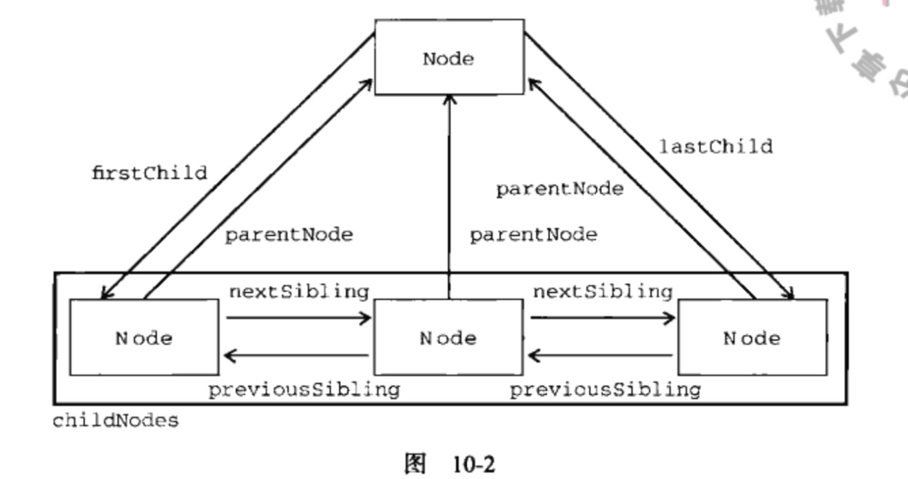

## 第十章 DOM 文本对象模型

#### 节点类型
- Node.ELEMENT_NODE(1)
- Node.ATTRIBUTE_NODE(2)
- Node.TEXT_NODE(3)
- Node.CDATA_SECTION_NODE(4)
- Node.ENTITY_REFERENCE_NODE(5)
- Node.ENTITY_NODE(6)
- Node.PROCESSING_INSTRUCTION_NODE(7)
- Node.COMMENT_NODE(8)
- Node.DOCUMENT_NODE(9)
- Node.DOCUMENT_TYPE_NODE(10)
- Node.DOCUMENT_FRAGMENT_NODE(11)
- Node.NOTATION_NODE(12)

通过节点的`nodeName`和`nodeValue`属性来判断节点

#### 节点关系

`hasChildNode()`方法判断有没有子节点，通过`childNodes`访问子节点，是一个NodeList对象
`length`属性来判断子节点个数

#### 操作节点
`appendChild()`方法，在最后一个子节点后添加子节点
`insertBefore()`方法，在节点前插入节点
`replaceChild()`方法，在文档中替换节点
`removeChild()`方法，再文档中删除节点
`choneNode()`方法，克隆节点，输入参数为true为深复制，否则为浅复制

#### 文档操作
`document.body`属性，指向文档中body
`document.title`属性，指向文档的title
`document.URL`属性，访问文档的URL
`document.domain`属性，访问文档的domain，可以实现跨域
`document.referrer`

#### 元素查找
`document.getELementById()`根据ID选取特定元素
`document.getELementsByTagName()`根据TagName选取元素集，返回的是HTMLCollection对象，类数组
`document.getELementsByName()` 
`document.anchors`属性，返回所有带有name的`<a>`
`document.forms`属性，返回文档中所有表单
`document.images`属性，返回文档中所有图片
`document.links`属性，返回所有带有href的`<a>`

#### 文档写入
`document.write document.writeln document.open document.close`
文档写入操作，不推荐使用

#### HTML元素
`getAttribute()`获取元素属性
`setAttribute()`设置元素属性
`removeAttribute()`删除元素属性
`attributes`属性，返回NamedNodeMap集合，可以用来遍历元素属性
`createElement()`创建新元素
`className`返回元素类名字符串

#### Text类型
`createTextNode()`创建文本节点
`normalize()`规范化文本节点

#### Document类型
`createDocumentFragment()`创建文档片段

#### 表单
`<table>`元素属性和方法
`caption`对标题的引用
`tBodies`对tbody的引用
`tFoot`对tfoot的引用
`tHead`对thead的引用
`rows`对所有行的引用
`createTHead()`创建thead并返回引用
`createTFoot()`创建tfoot并返回引用
`createCaption()`创建caption并返回引用
`deleteTHead()`删除thead
`deleteTFoot()`删除tfoot	
`deleteCaption()`删除caption
`deleteRow()`删除指定行
`insertRow()`插入指定行
`<tr>`元素属性和方法
`<tbody>`元素属性和方法
`rows`对所有行的索引
`deleteRow()`删除指定行
`insertRow()`插入指定行
`<tr>`
`cells`对所有单元格的索引
`deleteCell()`删除单元格
`insertCell()`插入单元格

