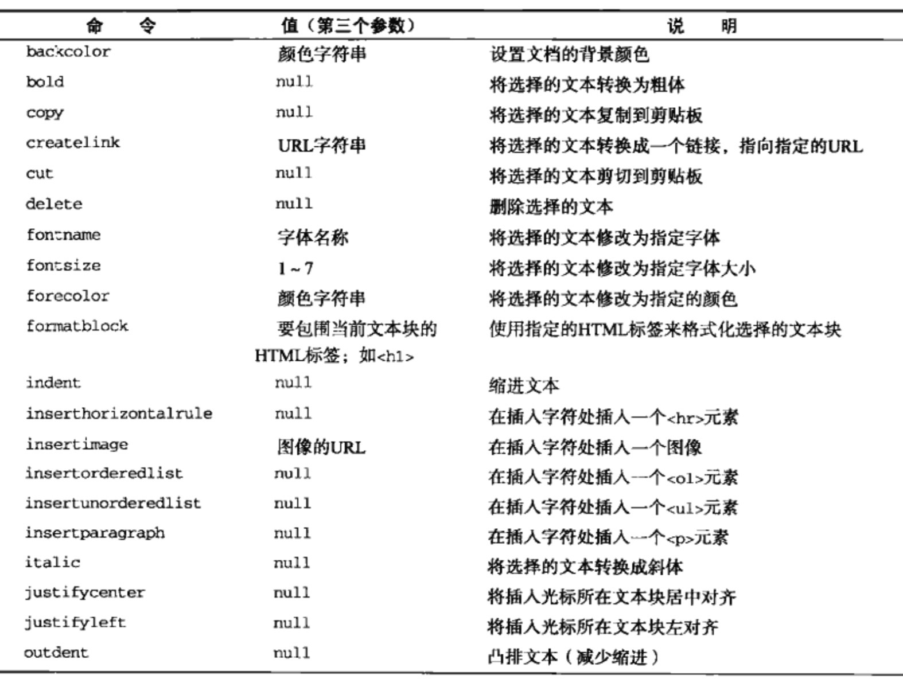
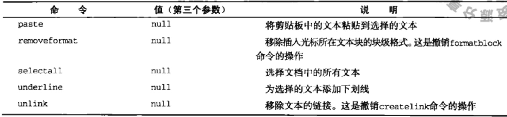

## 表单脚本

#### 表单基础
`acceptCharset` 服务器可以处理的字符集
`action` 接受请求的URL
`elements`	表单中所有控件的集合
`enctype` 请求编码的类型
`length` 表单中控件数量
`method` 要发送的HTTP的类型
`name` 表单的名称
`reset()` 重置所有表单为默认值
`submit()` 提交表单
调用表单submit方法不会引起触发表单的submit事件
`target` 用于发送请求和接受相应的窗口名称

- 共有的表单字段属性
`disabled` 布尔值，表示当前字段是否被禁用
`form` 指向当前字段所属表单
`name` 当前字段的名称
`readOnly` 布尔值，表示当前字段只读
`tabIndex` 表单当前字段的切换序号
`type` 当前字段的属性
`value` 当前字段将被提交给服务器的值

- 共有表单字段方法
`focus()` 将焦点设置到字段
`blur()` 将焦点移走

- 共有表单字段事件
`blur` 表单失去焦点是触发
`change` input和textarea元素失去焦点并value改变时触发
`focus` 表单获得焦点是触发

#### 文本框表单
`select`事件
`select()` 选中所有文本
`selectionSelect selectionEnd` 获取选择文本，开头和结尾
`setSelectionRange()` 选择两个端口的第一个索引和末尾索引
过滤输入 和 剪贴板事件
H5约束验证API
`required` 必填字段
`min max step` 数字字段最小值、最大值、刻度间差值
`pattern` 输入模式 pattern=`/\d+/`只能输入数字
`checkValidity()`方法 和 `validity` 属性检测表单输入的有效性
`novalidate` 禁用验证

#### 选择框文本
select对象
`add()` 添加option元素,两个参数使用方法类似于insertBefore()
`multiple`属性 允许多选
`options`属性 指向所有option对象
`remove()`方法 移除选项
`selectedIndex`属性，选中对象序号
`size`属性 选择框中可显示的行数
option对象
`index` 索引
`label` 当前选项的标签
`selected` 是否被选中
`text` 选项的文本
`value` 选项的值

#### 表单序列化

#### 富本文编辑
`designMode`属性，将页面转为可编辑状态
`contenteditable`属性 使div等可以编辑
`execCommand()`方法 执行预定义命令

`getSelection()`方法 选取选择区域 返回Selection对象

