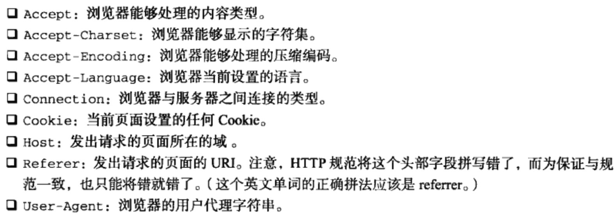

## JSON

#### 语法
JSON支持以下三种类型的值 简单值、对象、数组
`JSON.stringify()`
`JSON.parse()`
`toJSON()`

## AJAX 与 Comet

#### XMLHttpRequest对象
`open()`分别传入 请求类型 请求地址 同步或异步
`send()`传入请求数据
`responseText` 响应返回文本
`responseXML` 响应返回文档
`status` 响应返回HTTP状态
`statusText` 响应返回状态说明
`readyState` 请求/响应当前活动阶段状态码
 0 未初始化 
 1 启动 
 2 发送 
 3 接受 
 4 完成
 每次改变触发readystatechange事件
`abort` 中断请求
`setRequestHeader` 定义请求头信息
`getResponseHeader()` 获取响应头信息
`getAllResponseHeader()` 获取全部响应头信息

`GET, POST` 两个主要的HTTP方法

#### XMLHttpRequest 2级 
`FormData()` 可以用来规范表单数据
`timeout` 超时时间
`overrideMimeType()`重写响应的MIME
`loadstart`、`progress`、`error`、`abort`、`load`、`loadend` 给XMLHttpRequest对象新增的事件
`progress` 事件返回对象event, 包含有以下新特性
`target` 指向自己xhr对象
`lengthComputable` 属性，表示长度是否可以计算
`position` 已经下载数据
`totalSize` 总数据

#### 跨域
CORS 跨源资源共享
`Access-Control-Allow-Orgin` 服务器端是指返回头
图像Ping
JSONP

Comet 长轮询和流
WebSocket 

## 高级技巧

#### 高级函数
- 类型检测
	`Object.prototype.toString.call()` 可以检测变量类型

- 作用域安全的构造函数
- 惰性载入函数
- 函数绑定
- 函数柯里化

#### 不可扩展对象
`Object.preventExtensions()`
`Object.seal()`
`Object.freeze()`
`Object.isExtensible`
`Object.isSealed`
`Object.isFrozen`

#### 高级计时器
函数节流

#### 自定义事件
观察者模式

#### 拖放

