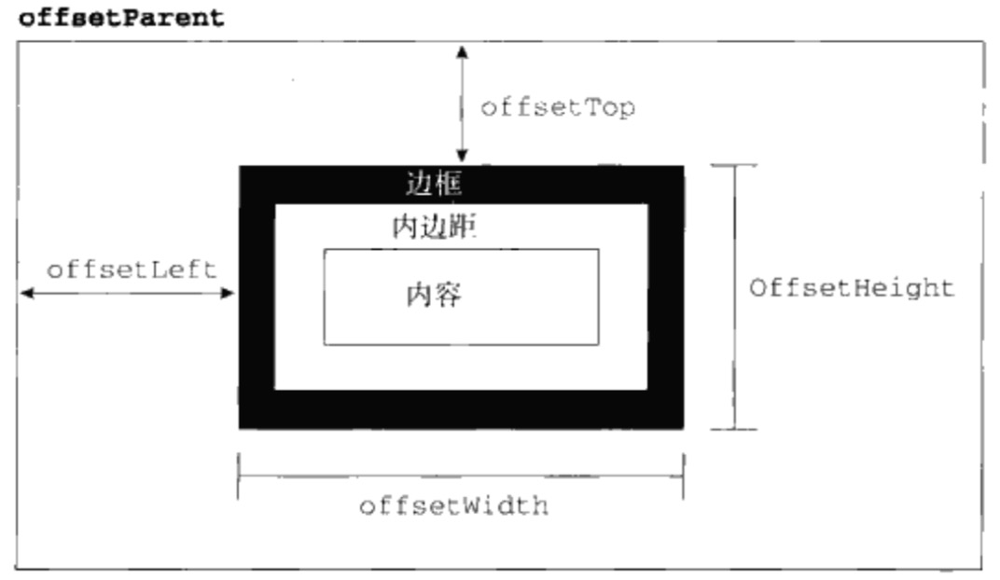
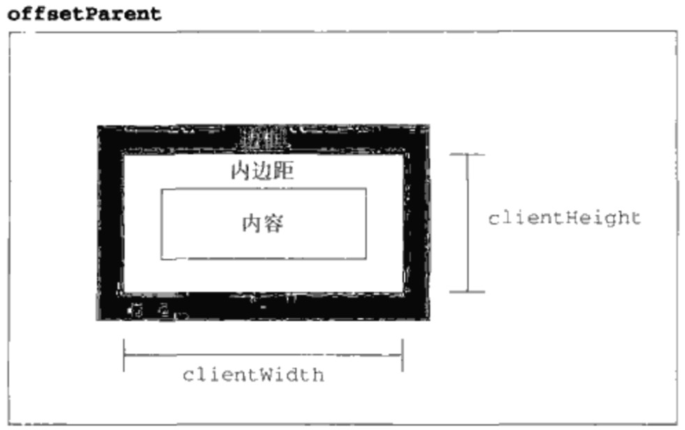
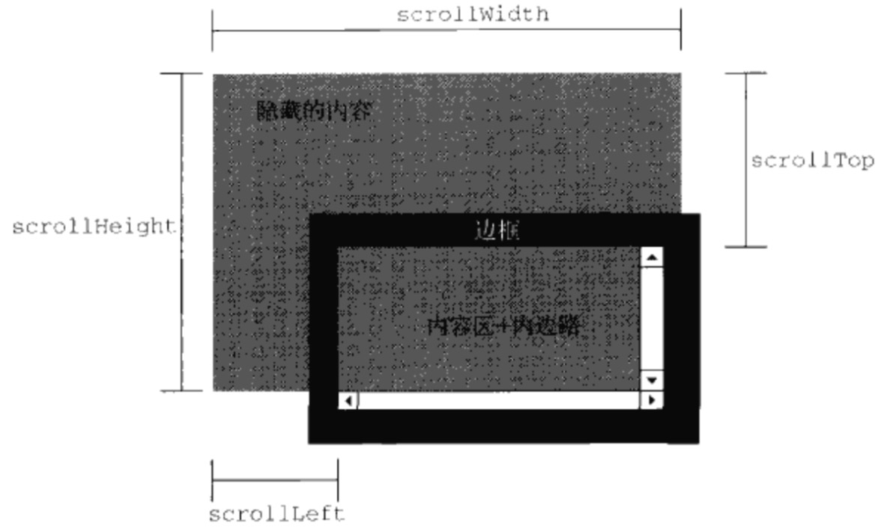

## DOM2和DOM3

#### 命名空间
Node节点新增属性
`localName`不带空间前缀的节点名称
`namespaceURI`命名空间URI
`prefix`命名空间前缀

#### 样式
dom元素通过可以style访问css对象
`cssText`访问css字符串
`length`css属性数量
`parentRule`
`getPropertyCSSValue()`
`getPropertyPriority()`
`getPropertyValue()`
`item()`
`removeProperty()`
`setProperty()`

偏移量
`offsetHeight`
`offsetWidth`
`offsetLeft`
`offsetTop`

客户区大小
`clientWidth`
`clientHeight`

滚动大小
`scrollHeight`
`scrollWidth`
`scrollLeft`
`scrollRight`

#### 遍历
`document.createNodeIterator(root,whatToShow,filter,extityReferenceExpansion)`构建函数，产生一个遍历的实例。root遍历开始的根节点，whatToShow访问那些节点的数字代码，filter一个NodeFilter对象，entityReferenceExpansion布尔值，表示是否要扩展实体引用，具体参考高级程序设计p.347。
NodeFilter对象只有一个方法acceptNode,返回NodeFilter.FILTER_ACCEPT或NodeFilter.FILTER_SKIP
NodeIteratord对象主要有两个方法`nextNode()`和`previousNode()`深度遍历向后和向前

`document.TreeWalker`相比于`NodeIterator`多了几种遍历的方法`parentNode() firstChild() lastChild() nextSibiling() previousSibiling()`

#### 范围
`document.creatRange()`创建一个范围实例
`startContainer`
`startOffset`
`endContainer`
`endOffset`
`commonAncestorContainer`
`selectNode()`
`selectNodeContents()`
`setStartBefore()`
`setStartAfter()`
`setEndBefore()`
`setEndAfter()`
`setStart(node,offset)`
`setEnd(noed,offset)`
`deleteContents()`删除所选范围
`extractContents()`删除所选范围，但会返回引用
`cloneContents()`克隆所选范围
`surroundContents()`环绕插入
`collapse()`折叠

